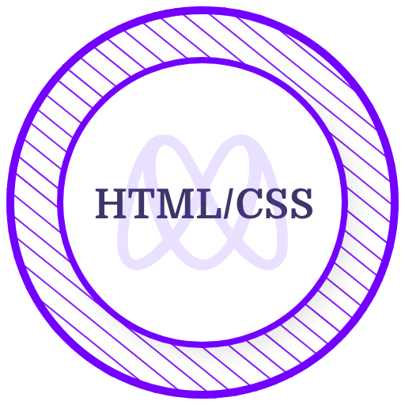

<h1 align="center">Ushindi Gedeon</h1>

<!-- Social icons section -->

&#8287;&#8287;&#8287;

&#8287;&#8287;&#8287;

&#8287;&#8287;&#8287;
 
&#8287;&#8287;&#8287;

### About Me  <be>

I'm a **Software Engineer** and **lifelong learner**.

> Detail-oriented with 3+ years of experience working remotely.

### Certificates & Licenses 🥇

  &nbsp; &nbsp; &nbsp; &nbsp;  
   &nbsp; &nbsp; &nbsp; &nbsp;  
     &nbsp; &nbsp; &nbsp; &nbsp;  
  &nbsp; &nbsp; &nbsp; &nbsp; 
   &nbsp; &nbsp; &nbsp; &nbsp; 

---

&nbsp;
 
| Activities  |   Contributions  |
| ----------- | ------------ |
|  |  |

### 🧰 Languages, Frameworks and libraries

    
    
    
    
    
    
    
    
    
    
    
    
    
    
    
    
    
    
    
    
    
    
    
    
    
    
    
    
    
    
    
    
    
    
    
    
    
    
    
    
    
    
    
    
    

  
 <em> If you want to say hello, I'll be happy to meet you! 😊 </em>
